# Faculty management System

A project for a college hackathon conducted by Mahindra. We won the 2nd price in this compettion. As we chose the frontend track we were expected to design the mockup of all the neccessary webpages. We made the design responsive for all screens.
We had to create seperate Dashboard for 2 users one for teachers and one for admin. So the credentials are - 
Admin user - username = admin password = admin
Teacher user - username = teacher password = teacher
We were not allowed to use technologies like bootstrap or any other css libraries so we made this using pure html css and javascript

# Pictures 
1. Home page - 
   - Desktop Screens

      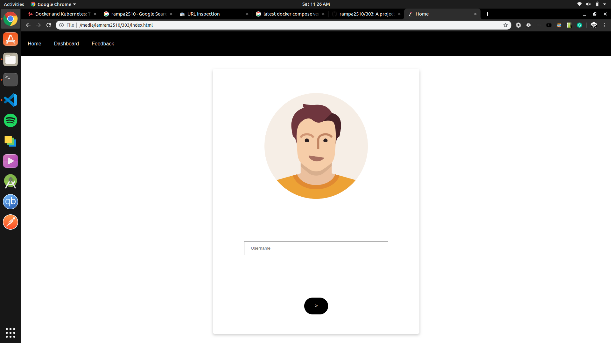

   - Mobile Screens

      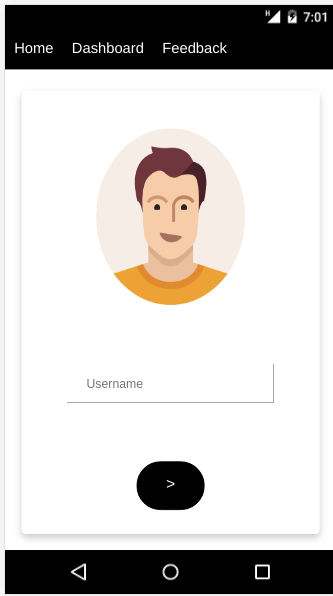

2. Dashboard page Admin - 
  - Desktop Screens

      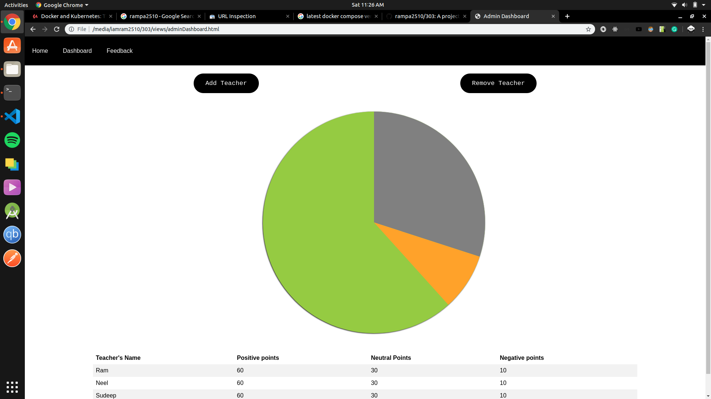

  - Mobile screens

      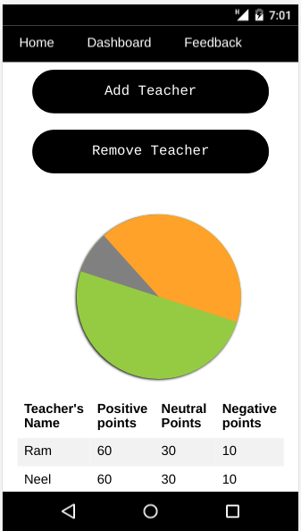

3. Dashboard page Teacher - 
   - Desktop Screens
  

      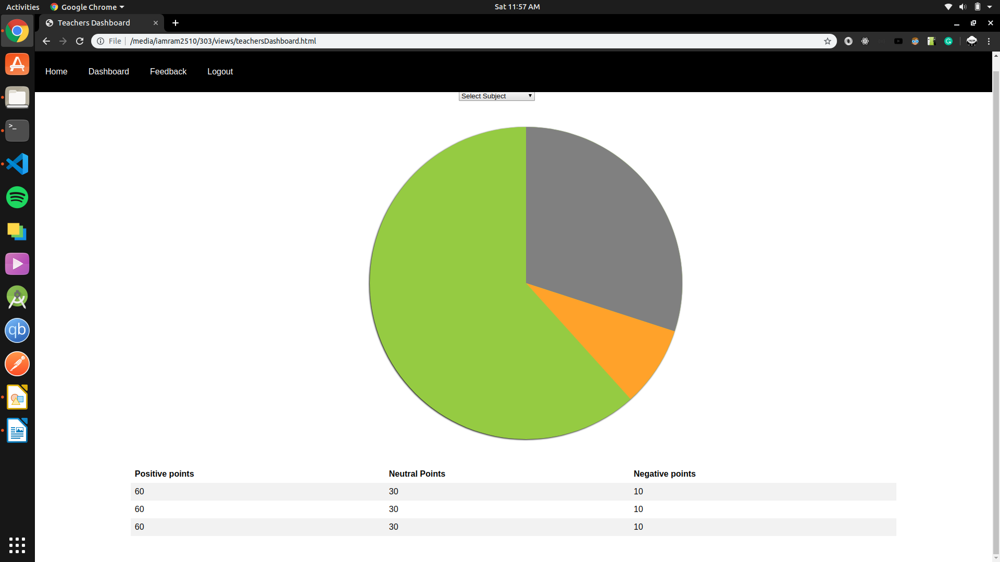

  - Mobile screens
  

      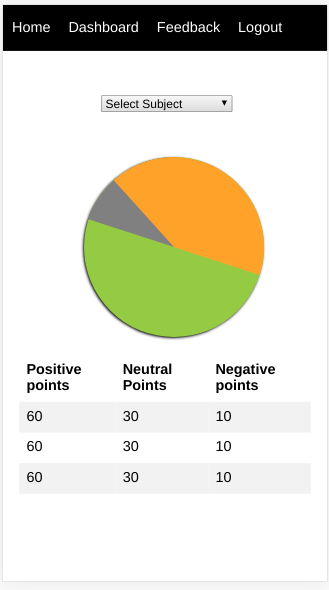

4. Add teacher page only for admin user
  - Desktop Screens

      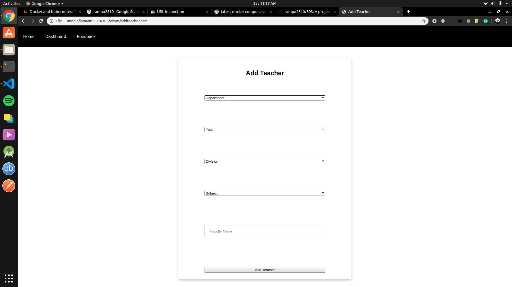

  - Mobile screens

      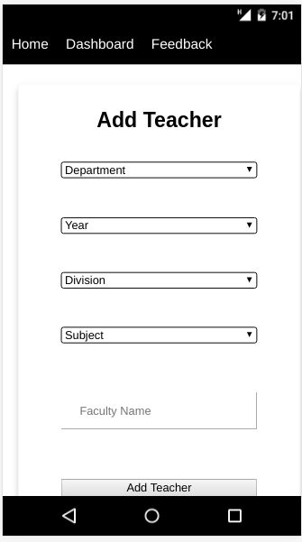
  
5. Remove Teacher page only for admin user
  - Desktop Screens

      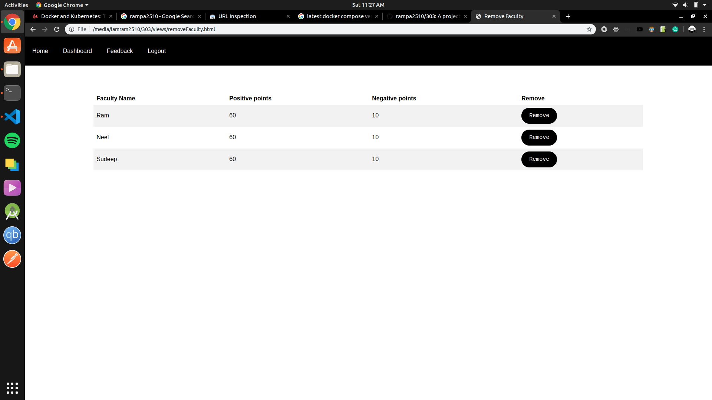

  - Mobile screens

      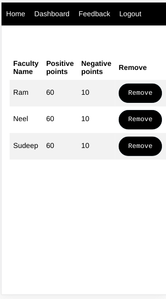

6. Feedback page for student user 
  - Desktop Screens

      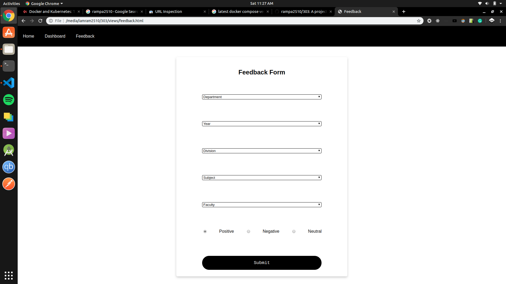

  - Mobile screens

      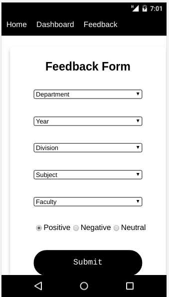